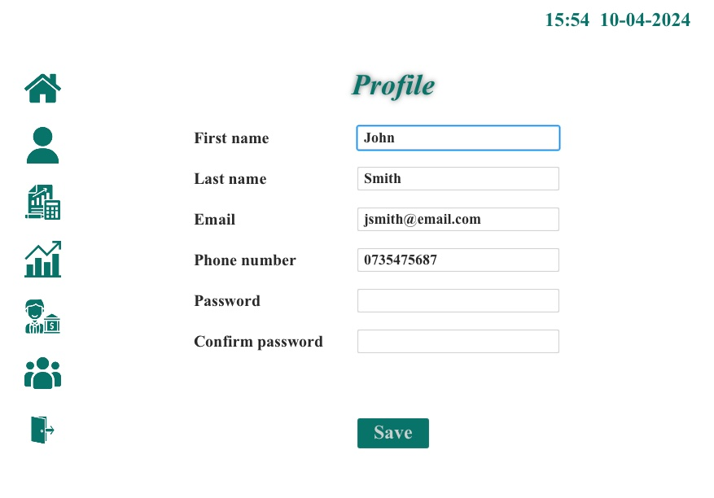

# FXMoney - JavaFX Bank Application

Welcome to FXMoney, a JavaFX bank application that I developed to showcase my Java programming skills and knowledge of JavaFx for developing GUIs.

FXMoney is a simulation of a bank that allows users to log in through three possible roles: Admin, Banker, and Client.

## Description
FXMoney has designed a wide range of features depending on the roles that might be useful for the platform's usage:

### Admin

-   **User Management**: Adding, updating, and deleting users, i.e. bankers and clients.
-   **User Information**: Seeing details related to the user.
-   **Statistics**: Access statistics about users, accounts, transactions, and loans.

     

### Banker

-   **Client Management**: Add clients to the system.
-   **Banking Operations**: Assist clients in depositing, withdrawing, transferring money, and changing information.
-   **Loan Requests**: Process loan requests on behalf of clients.

     

### Client

-   **ATM GUI**: Access an intuitive ATM-like interface for banking operations.
-   **Deposit & Withdrawal**: Deposit and withdraw money.
-   **Money Transfer**: Transfer funds to other clients within the system.
-   **Loan Requests**: Request loans through bankers.

     

## Installation

To run FXMoney locally, follow these steps:

1.  Clone this repository to your local machine:

`git clone https://github.com/marinescu97/FXMoney.git`

2. Set up the MySQL database:
-   Make sure you have MySQL installed on your machine.
-   Create a new database for FXMoney.
-   Import the provided `bank.sql` file, located in the `database` directory, into your MySQL database to create the necessary tables and populate initial data:

`mysql -u username -p database_name < bank.sql`

3. Update DataSource.java file:
-   Open the `DataSource.java` file located in the `src/main/java/com/marinescu/fxmoney/Model` directory.
-   Update the database connection details in the `DataSource` class with your MySQL database credentials:

    

4. Run MainApplication.java file:
- Open the project in your preferred Java IDE.
- Run the `MainApplication.java` file located in the `src/main/java/com/marinescu/fxmoney` directory.
- Follow the on-screen instructions to interact with the FXMoney application.

## Usage

After FXMoney is set up, you can use it based on your role: Admin, Banker, or Client. Here is a quick guide on using the application.

### For Admins

- **Logging In**: To start, please login using the provided admin credentials. The following is an example of an admin account that is currently stored in the database:

    `Username: jsmith`

    `Password: JSmith`

- **User Management**: Go to the 'Bankers' or 'Clients' section if you want to add, update, or delete users.

- **Viewing Statistics**: Access the 'Statistics' section to get detailed insights about accounts, transactions, and loans. This tool is really helpful for administrators to manage the financial operations and user activities of the application.
  

- **Updating Profile**: As an admin, you can easily update your profile info. Just head over to the 'Profile' section and make any changes to your personal details to ensure your account is current and accurate.

     

- **Viewing Account Details**: You also have the capability to view your own account details.

     

### For Bankers

Bankers play a crucial role in the FXMoney application, providing a bridge between administrative functions and client services. Here's how bankers can navigate and utilize the system:

-   **Updating Profile**: When bankers log in, they can choose to edit their profile details.

     

-   **Adding a Client**: Bankers can add new clients to the system to expand the banking community. This is done through the 'Add Client' section.

     

-   **Searching for a Client**: Bankers can use the search function to effectively manage client accounts or help clients with their inquiries. This feature allows bankers to quickly locate a client's account by pin.

     

-   **Managing Client Accounts**: Once a client is chosen, bankers can oversee their accounts. This includes checking account information, depositing or withdrawing money, opening a new account, and moving funds for the client.

     

-   **Requesting a Loan for a Client**: Bankers are able to help clients in obtaining loans by going to the 'Request Loan' section. In this area, you will input the client's loan information and send the request for approval. This functionality showcases the important role that bankers play in providing financial services tailored to clients' requirements.

     

### For Clients

Clients have access to a suite of features designed to emulate real-world banking services within the FXMoney application. Here’s how clients can navigate and utilize their banking features:

-   **ATM-Like Interface**: After logging in, clients are presented with an ATM-like interface. This design is aimed at simplifying the user experience, allowing clients to perform various banking transactions with ease.

-   **Making Transactions**: Within the application, clients can deposit or withdraw funds, and transfer money to other clients.

     

-   **Viewing Account Details**: Clients are able to view comprehensive details regarding their accounts, such as their up-to-date balance and recent transaction history. This feature ensures that clients are always informed about their financial status.

-   **Changing Password**: For security purposes, clients have the capability to change their password directly through the ATM interface. This function is crucial for maintaining the security of clients' accounts and personal information.

## Database
The FXMoney application uses a MySQL database to store and manage users, accounts, transactions, and loans. Below is a visual representation of the database structure:

## Technologies

The FXMoney app uses advanced technologies and libraries to offer a smooth and user-friendly banking experience. Here are the main components:

-   **Java 19**: Java 19 is the primary programming language, known for its strong performance and compatibility features. It ensures a reliable base for the app's backend logic and functions.

-   **JavaFX**: JavaFX is used to create the dynamic and engaging user interface. It allows for the development of a responsive and visually attractive desktop app.

-   **ControlsFX**: ControlsFX is an open-source project that adds extra UI controls and components to JavaFX. This enhances the user interface with more sophisticated elements for an improved user experience.

-   **CSS for FXML Files**: Cascading Style Sheets (CSS) are used to style the FXML files, providing a customized and consistent appearance across the application's different screens.

-   **JFoenix**: An innovative JavaFX library that implements Google Material Design through Java components. JFoenix enhances the application with modern and attractive UI elements that are both stylish and practical.

-   **MySQL Connector/J**: The official JDBC driver for MySQL, this connector enables the application to securely access and manage data stored in a MySQL database, ensuring reliable data storage and retrieval.

-   **Apache PDFBox**: A Java tool for handling PDF documents, it is open-source and allows the application to create, edit, and retrieve content from PDFs. This is particularly useful for tasks such as generating reports, receipts, and other document-related functions.

-   **ValidatorFX**: Taken from a [GitHub repository](https://github.com/effad/ValidatorFX), ValidatorFX is a validation library designed for JavaFX. It streamlines input validation, guaranteeing data accuracy and correct user input across the entire application.

## License
The FXMoney application is distributed under the [MIT License](https://opensource.org/license/mit).
### ValidatorFX (BSD 3-Clause License)
ValidatorFX, a library used in this application for input validation, is distributed under the [BSD 3-Clause License](https://opensource.org/licenses/BSD-3-Clause). 

